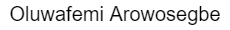

# Lendsqr-fe-test Frontend App Readme-md

[LOGIN-PAGE](https://oluwafemi-arowosegbe-lendsqr-fe-test.netlify.app/ "lendsqr-fe-test")

## Prerequisites Knowlegde

---

- JavaScript
- HTML
- CSS

## Tools and Languages

---

- ReactJS
- SCSS

## Design

---

App comprises of 4 pages

- Login Page : Sign in with a valid email and any password of choice (JS validation)

- Dashboard Page: After providing required authentication info on **Login page**, the user is directed to the **dashboard**. User credentials are saved in a Auth State, and an admin role is issued to any user after a successful login. This admin-level-role allows a logged-in user, access all the pages of this mini app.

  - Dashboard page displays the returned api dummy users informations.
  - Dashboard page also provides the functionality that enables the mutating of the returned data.

- User Details Page : Displays detailed info of a particular dummy user returned from the api.

- Page not found : To catch routes not existing in application

## Installation

---

_Command to be run in terminal >_

> npm install

## Usage

---

_Command to be run in terminal >_

> npm run start

## Run Test

---

_Command to be run in terminal >_

> npm run test

## Author

---

- Email: [femiaros19@gmail.com](https://mail.google.com/)
- Twitter: [@femi_frozee](https://twitter.com/femi_frozee)

## Show your Support

---

Give a :star: if project was helpful

## :page_facing_up: License

---

Copy &#169; 2022 Twitter: [Oluwafemi Arowosegbe]()

Project is [MIT](https://opensource.org/licenses/MIT) licensed
